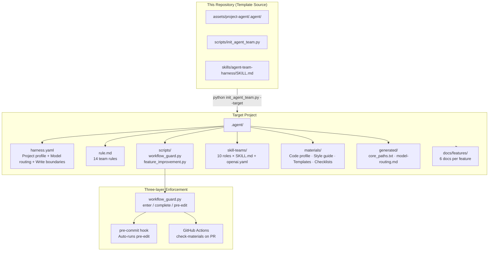
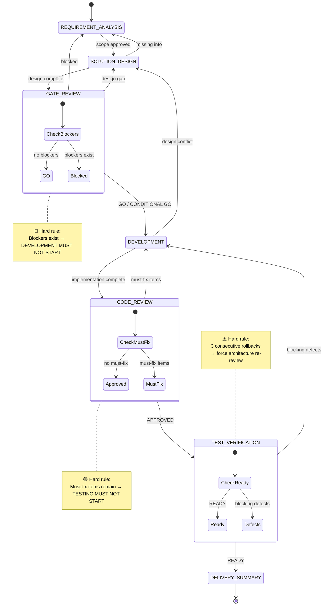
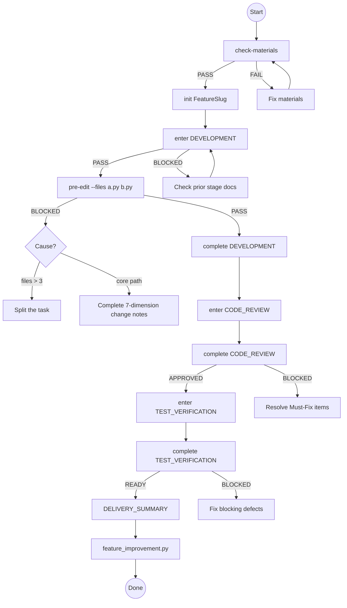

# Agent Team Harness

> A **file-based, executable, auditable** AI development team workflow. Doesn't replace your toolchain. Doesn't touch your production code — injects discipline into a single `.agent/` directory.

[中文版本](README.md)

---

## What Makes It Different?

Most AI coding tools answer "how to write code." Agent Team Harness answers "when to write, who writes, who reviews, and how to roll back" — it gives your AI team engineering discipline before autonomous coding begins.

| Dimension | Prompt Engineering | IDE Plugin / Copilot | CI Pipeline | **Agent Team Harness** |
|-----------|-------------------|---------------------|-------------|------------------------|
| Enforcement | Prompt suggestions | UI intercept | Post-hoc check | **Pre-gate + in-flight check + post-improvement** |
| Cross-project reuse | Manual copy | Tool-bound | Config required | **One-command init, auto-adapts language/framework** |
| Role separation | None | None | None | **10 roles, tiered by model capability** |
| Auditability | Chat history | None | Logs | **6 standardized feature docs, artifact per stage** |
| Continuous improvement | None | None | Manual | **Auto-extract reusable patterns after feature delivery** |
| Invasiveness | None | Low | Medium (CI config) | **Minimal: `.agent/` only, zero external deps** |

**In one sentence:** It won't write better code for you — but it ensures you and your AI team think before coding: design approved? Gates passed? Concurrency and rollback plan for core paths written down?

---

## Core Architecture



---

## Complete Workflow: From Requirement to Delivery

Every non-trivial requirement must pass 7 stages, each with explicit gates and rollback paths:



Each stage is owned by a dedicated role using a model matched to its risk level:

| Stage | Owner | Model Tier | Gate Check |
|-------|-------|-----------|------------|
| REQUIREMENT_ANALYSIS | requirement-analyst | balanced | Scope/out-of-scope/acceptance criteria complete |
| SOLUTION_DESIGN | solution-architect | reasoning | Modules/interfaces/consistency/rollback/observability |
| GATE_REVIEW | gate-reviewer | balanced | **Decision must be GO**, Blocker table must be empty |
| DEVELOPMENT | developer-agent / specialist | **strongest** | Material compliance / pre-edit file check / 7 core-path notes |
| CODE_REVIEW | code-reviewer | **strongest** | **Decision must be APPROVED**, Must-Fix must be cleared |
| TEST_VERIFICATION | qa-tester | balanced | **Decision must be READY**, rollback + observability verified |
| DELIVERY_SUMMARY | pm-orchestrator | balanced | Continuous improvement: run feature_improvement.py |

### Guard Command Reference



---

## Absolutely Safe for Your Project

> **We only create a `.agent/` directory in your project. Nothing else.**

### What We DON'T Do

- ❌ **Never modify your source code**: initialization only writes to `.agent/`, never touches `src/`, `app/`, `lib/`, or any production path
- ❌ **Never modify your build configuration**: `package.json`, `pom.xml`, `pyproject.toml`, `go.mod` stay untouched
- ❌ **Never modify your Git configuration**: `.gitignore`, `.git/config` remain unchanged
- ❌ **Never install dependencies**: both core scripts (`init_agent_team.py`, `workflow_guard.py`) use only the Python standard library
- ❌ **Never connect to external services**: all detection and analysis runs on the local filesystem
- ❌ **Never upload your code**: no telemetry, no analytics, no network requests

### Write Boundaries

Allowed write paths are controlled by a whitelist in `.agent/harness.yaml`. The default whitelist includes only:

```yaml
# Auto-detected production code paths (e.g. src/main/**, app/**, lib/**)
# + tests/**
# + .agent/**
# + docs/features/**
```

The following paths are permanently blocked:

```yaml
.git/**          # version control
.idea/** .vscode/**  # IDE metadata
node_modules/** target/** build/** dist/**  # build artifacts
.env .env.*      # secrets and credentials
```

### Conservative Strategy

- If `.agent/` already exists in the target project, files are **not overwritten** by default — conflicts go to `.agent-team-new`
- Only `--force` explicitly allows overwrites
- Remove `.agent/` at any time to return to the original state — **zero residue**

---

## Get Started in 5 Minutes

### Step 1: Initialize

```bash
# Run from this repo, pointing at your target project
python scripts/init_agent_team.py \
  --target /path/to/your-project \
  --models "gpt-5.5,claude-3.5-sonnet,deepseek-chat"
```

The script automatically:
1. Scans project languages, frameworks, build tools, and test commands
2. Performs risk grading on code content (CRITICAL → HIGH → MEDIUM → LOW), auto-marks core paths
3. Scores your model list by capability and assigns the strongest to implementation/review roles
4. Generates `.agent/harness.yaml`, `rule.md`, role configs, and 6 template documents

Supports three model families with automatic scoring:

| Family | Flagship (100) | Premium (90) | Standard (80) | Balanced (65) |
|--------|---------------|-------------|--------------|--------------|
| GPT | gpt-5.5 | gpt-5.4 | gpt-5 | gpt-4.1 |
| Claude | claude-opus-4 | claude-sonnet-4 | claude-3-opus | claude-3.5-sonnet |
| DeepSeek | deepseek-v4 | deepseek-r1 | deepseek-v3 | deepseek-chat |

If Python is unavailable, use the Shell bootstrap to copy templates first:

```bash
sh scripts/init_agent_team.sh --target /path/to/your-project
```

### Step 2: Review Generated Files

```bash
cd /path/to/your-project
cat .agent/harness.yaml       # Project profile, model routing, write boundaries
cat .agent/rule.md            # 14 team rules
cat .agent/generated/core_paths.txt  # Core path inventory — review for false positives/misses
cat .agent/generated/model-routing.md # Model assignments — verify availability
```

### Step 3: Start Developing

```bash
# Verify material integrity
python .agent/scripts/workflow_guard.py check-materials

# Initialize a feature
python .agent/scripts/workflow_guard.py init UserProfileCache

# Enter development (gate checks prior stages are complete)
python .agent/scripts/workflow_guard.py enter UserProfileCache DEVELOPMENT

# Run pre-edit before writing code
python .agent/scripts/workflow_guard.py pre-edit UserProfileCache \
  --files src/services/user_service.py src/cache/user_cache.py

# Complete the stage
python .agent/scripts/workflow_guard.py complete UserProfileCache DEVELOPMENT
```

---

## Role System

The project includes 10 roles covering the full chain from requirements to delivery:

```
project-dev-team/
├── pm-orchestrator          ← State machine control, blocker tracking
├── requirement-analyst      ← Scope / out-of-scope / acceptance criteria
├── solution-architect       ← Modules / interfaces / consistency / rollback
├── gate-reviewer            ← Go / No-Go decision
├── developer-agent          ← General implementation (fallback when no specialist)
├── java-engineer            ← Spring Boot / MyBatis / MQ specialist
├── python-engineer          ← FastAPI / Django / pytest specialist       ⬅️ new
├── go-engineer              ← gRPC / Gin / errgroup specialist            ⬅️ new
├── frontend-engineer        ← React / Vue / Next.js specialist            ⬅️ new
├── java-architect           ← High-concurrency / e-commerce architecture specialist
├── performance-optimizer    ← QPS / RT / hotspot / cache / capacity analysis
├── code-reviewer            ← Production risk review
└── qa-tester                ← Test plan / regression / defect classification
```

Each role contains `SKILL.md` (behavior rules) and `agents/openai.yaml` (model routing config). When a language-specific role is missing, the system falls back to `developer-agent`.

---

## Limitations — Being Honest

### 1. Enforcement is at the File Level, Not System Level

`workflow_guard.py` checks "are the documents filled in" rather than "is the code correct." An agent can skip `enter DEVELOPMENT` and write code directly — the guard is an advisor, not an enforcer.

**Mitigation:** Run `generate-hooks` to install a Git pre-commit hook and CI guard workflow, establishing system-level constraints at commit and PR time.

### 2. Model Scoring Requires Manual Maintenance

Although GPT/Claude/DeepSeek families are supported, new model releases require updating `MODEL_SCORING_RULES`. Automatic capability ranking from APIs is not supported.

### 3. Single-Repository Design

The `.agent` structure assumes all code lives in one repository. Microservice multi-repo setups require independent initialization per repository; cross-repo coordination is out of scope.

### 4. Document Labels Are in English

Gate checks depend on fixed English labels (e.g., `Decision: GO`, `- Rollback plan verified: yes`). Non-English projects will encounter mixed-language documents.

### 5. Not a CI/CD Replacement

This tool manages "AI team development discipline," not your build, test, or deployment pipeline. It is complementary to your CI — we recommend calling `workflow_guard.py check-materials` in CI as an additional check layer.

### 6. Core Path Detection Is Static

Risk grading is based on file content (first 500 lines) semantic analysis, but does not trace runtime call chains. A low-risk utility function may be indirectly called by a high-risk path — this requires manual review of `core_paths.txt`.

---

## Guidelines

### For Users

1. **Review before developing**: after initialization, review `harness.yaml`, `core_paths.txt`, and `model-routing.md` before starting to code
2. **Don't commit on BLOCKED**: a `BLOCKED` result means there's a gap in the process — fill in the docs before continuing
3. **Stop after 3 rollbacks**: 3 consecutive rollbacks on the same stage suggests the requirements or architecture itself may be flawed
4. **Don't promote one-off workarounds**: patterns extracted by `feature_improvement.py` must be reusable — don't codify accidental compromises as rules
5. **Core paths require 7 extra dimensions of notes**: transaction boundaries, thread safety, cache strategy, idempotency, timeout/retry/circuit-breaker/degradation, exception handling, audit & observability

### Tool Principles

1. **Zero external dependencies**: core scripts use only the Python standard library
2. **Never change existing files**: conflicts go to `.agent-team-new`, requiring manual merge
3. **Never connect to production systems**: no real API calls, no database operations
4. **All decisions are traceable**: each stage produces a standardized document, not a chat transcript

---

## FAQ

<details>
<summary><b>Q: Will this affect my existing CI/CD?</b></summary>

No. The `.github/workflows/agent-guard.yml` generated by `generate-hooks` is an independent check step — you can choose to install it or not. It runs in parallel with your existing CI.
</details>

<details>
<summary><b>Q: Is the CI hook useful if my project doesn't use GitHub?</b></summary>

The Git pre-commit hook is universal (not platform-bound). The `generate-hooks` shell script works in any Git repository. The CI workflow is GitHub Actions format — if you use GitLab CI or Jenkins, refer to `.agent/generated/pre-commit-hook.sh` to create an equivalent step yourself.
</details>

<details>
<summary><b>Q: Can I use only part of the functionality?</b></summary>

Yes. Every component in `.agent/` is an independent file. Delete roles you don't need, skip stages you don't use (gates will warn but not block). Minimal usage: run `init` to generate feature doc templates, fill them in by hand, and skip `enter`/`complete`.
</details>

<details>
<summary><b>Q: How do I uninstall?</b></summary>

```bash
rm -rf .agent/ docs/features/
```

If a pre-commit hook was installed:

```bash
rm -f .git/hooks/pre-commit
```

That's it. Your source code is completely unaffected.
</details>

<details>
<summary><b>Q: Which languages are supported?</b></summary>

Auto-detection: Java, Kotlin, Python, JavaScript, TypeScript, Go, Rust, C#, PHP, Ruby, Swift, SQL.

Role coverage: Java (specialist), Python (specialist), Go (specialist), Frontend (JS/TS/React/Vue, specialist). Other languages fall back to the general `developer-agent`.
</details>

---

## Contributing & License

This project is a set of engineering discipline templates, not bound to any specific model vendor.

- **Model scoring rules**: edit `MODEL_SCORING_RULES` in `skills/agent-team-harness/scripts/init_agent_team.py`
- **Role skills**: add or modify roles under `assets/project-agent/.agent/skill-teams/project-dev-team/`
- **Guard rules**: extend checks in `assets/project-agent/.agent/scripts/workflow_guard.py`
- **Template docs**: update feature doc templates under `assets/project-agent/.agent/templates/`

Licensed under the **MIT License**. See the LICENSE file at the repository root.
