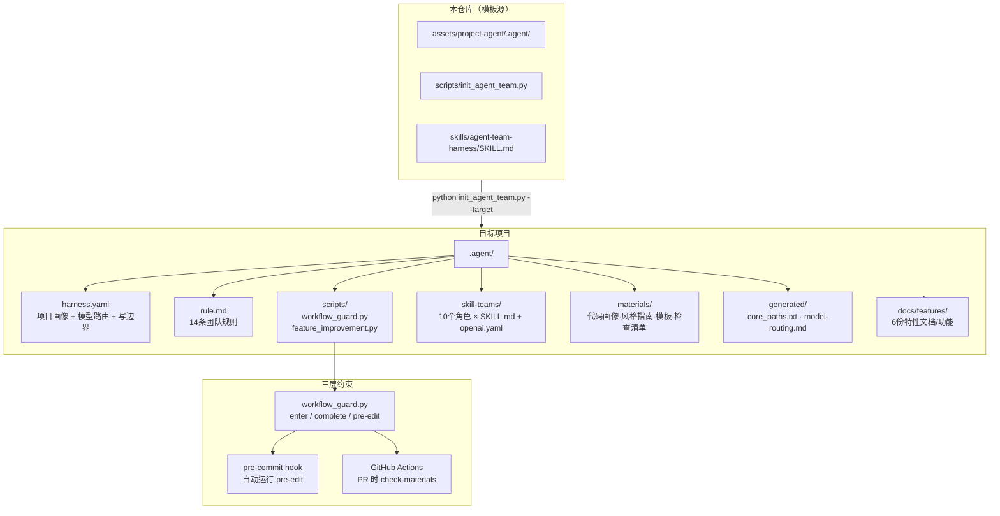
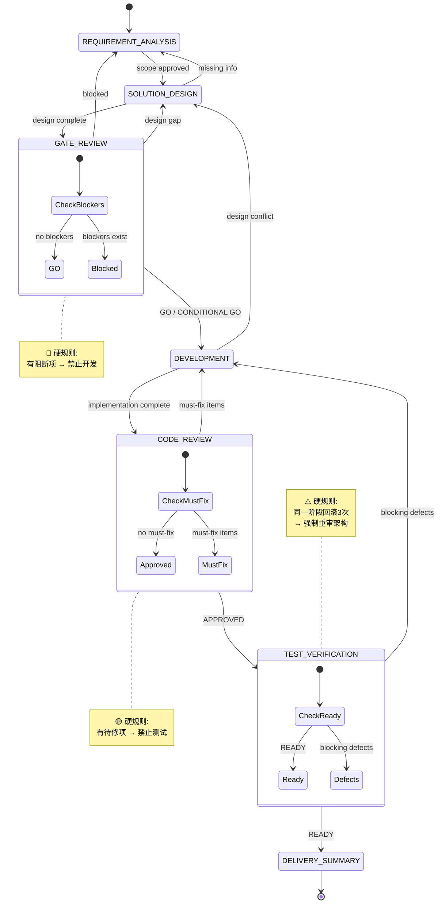
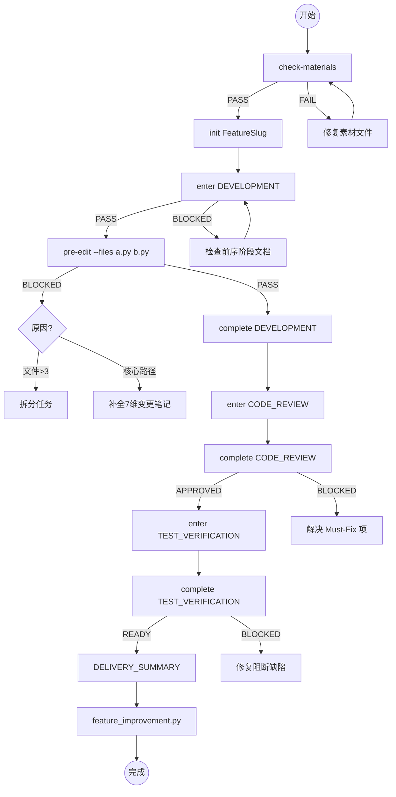

# Agent Team Harness

[English](README.en.md)

> 一套 **文件化、可执行、可审计** 的 AI 开发团队工作流。不替换你的工具链，不影响你的生产代码——只在项目的 `.agent/` 目录下注入纪律。

---

## 它跟别的方案有什么不同？

大多数 AI 编码工具解决的是"怎么写代码"的问题。Agent Team Harness 解决的是"什么时候该写、谁来写、写完有没有人审、出了问题怎么回滚"——在 AI 自主编码之前，先给它一套工程纪律。

| 对比维度 | 纯 Prompt 工程 | IDE 插件 / Copilot | CI 流水线 | **Agent Team Harness** |
|---------|---------------|-------------------|----------|----------------------|
| 约束方式 | 提示词建议 | UI 拦截 | 事后检查 | **事前门禁 + 事中检查 + 事后改进** |
| 跨项目复用 | 需手动复制 | 绑定工具 | 需配置 | **一键初始化，自动适配语言/框架** |
| 角色分工 | 无 | 无 | 无 | **10 个角色，按模型能力分级路由** |
| 可审计性 | 聊天记录 | 无 | 日志 | **6 份标准化特性文档，每个阶段留痕** |
| 持续改进 | 无 | 无 | 手动 | **特性交付后自动提炼可复用模式** |
| 侵入性 | 无 | 低 | 中（需要 CI 配置） | **极低：仅写入 `.agent/`，零外部依赖** |

**一句话：** 它不会帮你写出更好的代码，但它会让你和你的 AI 团队在写代码之前想清楚——设计审批了吗？门禁过了吗？核心路径的并发和回滚方案写了吗？

---

## 核心架构



---

## 完整工作流：从需求到交付

每个非琐碎需求必须经过 7 个阶段，每个阶段有明确的"门禁守卫"和"回滚路径"：



每个阶段由专属角色负责，使用匹配其风险等级的模型：

| 阶段 | 负责角色 | 模型等级 | 门禁检查 |
|------|---------|---------|---------|
| REQUIREMENT_ANALYSIS | requirement-analyst | balanced | 范围/非范围/验收标准是否完整 |
| SOLUTION_DESIGN | solution-architect | reasoning | 模块/接口/一致性/回滚/可观测性 |
| GATE_REVIEW | gate-reviewer | balanced | **Decision 必须 GO**，Blocker 表必须空 |
| DEVELOPMENT | developer-agent / 语言专项 | **strongest** | 素材合规 / pre-edit 文件检查 / 核心路径7维笔记 |
| CODE_REVIEW | code-reviewer | **strongest** | **Decision 必须 APPROVED**，Must-Fix 必须清空 |
| TEST_VERIFICATION | qa-tester | balanced | **Decision 必须 READY**，回滚计划 + 可观测性已验证 |
| DELIVERY_SUMMARY | pm-orchestrator | balanced | 持续改进：运行 feature_improvement.py |

### Guard 命令速查表



---

## 对你的项目绝对安全

> **我们只在你的项目中创建 `.agent/` 目录。仅此而已。**

### 不做什么

- ❌ **不修改你的源代码**：初始化只写入 `.agent/`，不触碰 `src/`、`app/`、`lib/` 等任何生产路径
- ❌ **不修改你的构建配置**：不会动 `package.json`、`pom.xml`、`pyproject.toml`、`go.mod`
- ❌ **不修改你的 Git 配置**：`.gitignore`、`.git/config` 保持不变
- ❌ **不安装任何依赖**：两个核心脚本（`init_agent_team.py`、`workflow_guard.py`）仅使用 Python 标准库
- ❌ **不连接外部服务**：所有检测和分析都在本地文件系统完成
- ❌ **不上传代码**：没有遥测，没有分析服务，没有任何网络请求

### 写入边界

写入路径由 `.agent/harness.yaml` 中的白名单控制。默认白名单仅包含：

```yaml
# 自动检测的生产代码路径（如 src/main/**, app/**, lib/**）
# + tests/**
# + .agent/**
# + docs/features/**
```

以下路径永远禁止写入：

```yaml
.git/**          # 版本控制
.idea/** .vscode/**  # IDE 元数据
node_modules/** target/** build/** dist/**  # 构建产物
.env .env.*      # 密钥文件
```

### 保守策略

- 如果目标项目已存在 `.agent/`，默认**不覆盖**，冲突文件写入 `.agent-team-new` 后缀
- 只有明确传递 `--force` 才会覆盖
- 可以随时删除 `.agent/` 目录回到初始状态——**零残留**

---

## 5 分钟开始

### 第一步：初始化

```bash
# 在本仓库运行，指向你的目标项目
python scripts/init_agent_team.py \
  --target /path/to/your-project \
  --models "gpt-5.5,claude-3.5-sonnet,deepseek-chat"
```

脚本会自动：
1. 扫描项目语言、框架、构建工具、测试命令
2. 按代码内容做风险分级（CRITICAL → HIGH → MEDIUM → LOW），自动标记核心路径
3. 将你的模型列表按能力评分排序，分配最强模型给实现/审查角色
4. 生成 `.agent/harness.yaml`、`rule.md`、角色配置、6 份模板文档

支持三大模型系列评分：

| 系列 | 旗舰 (100) | 高端 (90) | 标准 (80) | 均衡 (65) |
|------|-----------|----------|----------|----------|
| GPT | gpt-5.5 | gpt-5.4 | gpt-5 | gpt-4.1 |
| Claude | claude-opus-4 | claude-sonnet-4 | claude-3-opus | claude-3.5-sonnet |
| DeepSeek | deepseek-v4 | deepseek-r1 | deepseek-v3 | deepseek-chat |

如果没有 Python 环境，可以用 Shell 引导脚本先复制模板：

```bash
sh scripts/init_agent_team.sh --target /path/to/your-project
```

### 第二步：审核生成的内容

```bash
cd /path/to/your-project
cat .agent/harness.yaml       # 项目画像、模型路由、写边界
cat .agent/rule.md            # 14条团队规则
cat .agent/generated/core_paths.txt  # 核心路径清单——审核误报和漏报
cat .agent/generated/model-routing.md # 模型分配——确认可用
```

### 第三步：开始开发

```bash
# 检查素材完整性
python .agent/scripts/workflow_guard.py check-materials

# 初始化一个特性
python .agent/scripts/workflow_guard.py init UserProfileCache

# 进入开发阶段（门禁检查前序阶段是否完成）
python .agent/scripts/workflow_guard.py enter UserProfileCache DEVELOPMENT

# 写代码前先跑 pre-edit
python .agent/scripts/workflow_guard.py pre-edit UserProfileCache \
  --files src/services/user_service.py src/cache/user_cache.py

# 完成后
python .agent/scripts/workflow_guard.py complete UserProfileCache DEVELOPMENT
```

---

## 角色体系

项目内置 10 个角色，覆盖从需求到交付的全链路：

```
project-dev-team/
├── pm-orchestrator          ← 状态机控制、阻断跟踪
├── requirement-analyst      ← 范围/非范围/验收标准
├── solution-architect       ← 模块/接口/一致性/回滚
├── gate-reviewer            ← Go/No-Go 决策
├── developer-agent          ← 通用实现（无语言专项时使用）
├── java-engineer            ← Spring Boot / MyBatis / MQ 专项
├── python-engineer          ← FastAPI / Django / pytest 专项    ⬅️ 新增
├── go-engineer              ← gRPC / Gin / errgroup 专项        ⬅️ 新增
├── frontend-engineer        ← React / Vue / Next.js 专项        ⬅️ 新增
├── java-architect           ← 高并发/电商架构专项
├── performance-optimizer    ← QPS/RT/热点/缓存/容量分析
├── code-reviewer            ← 生产风险审查
└── qa-tester                ← 测试计划/回归/缺陷分类
```

每个角色包含 `SKILL.md`（行为规则）和 `agents/openai.yaml`（模型路由配置）。语言专项角色缺失时自动回退到 `developer-agent`。

---

## 局限性——诚实地说

### 1. 约束力在文件层面，不在系统层面

`workflow_guard.py` 检查的是"文档写没写"而不是"代码对不对"。Agent 可以跳过 `enter DEVELOPMENT` 直接写代码——门禁是 advisor，不是 enforcer。

**缓解措施：** 运行 `generate-hooks` 安装 Git pre-commit hook 和 CI guard workflow，在 commit 和 PR 层面建立系统级约束。

### 2. 模型评分需要手动维护

虽然已支持 GPT/Claude/DeepSeek 三大系列，但新模型发布后需要更新 `MODEL_SCORING_RULES`。不支持自动从 API 获取模型能力排行。

### 3. 单仓库设计

`.agent` 结构假设所有代码在一个仓库中。微服务多仓库需要每个仓库独立初始化，仓库间的协调不在能力范围内。

### 4. 文档标签为英文

门禁检查依赖固定的英文标签（如 `Decision: GO`、`- Rollback plan verified: yes`）。中文项目使用时会遇到语言混合。

### 5. 不替代 CI/CD

本工具管理的是"AI 团队的开发纪律"，不替代你的构建、测试、部署流水线。它和你的 CI 是互补关系——建议在 CI 中调用 `workflow_guard.py check-materials` 作为额外检查层。

### 6. 核心路径检测是静态的

风险分级基于文件内容（前 500 行）做语义分析，但不追踪运行时调用链。一个低风险工具函数可能被高风险路径间接调用，这种情况需要人工审核 `core_paths.txt`。

---

## 准则

### 使用者应遵守的

1. **先审核再开发**：初始化后，必须先审核 `harness.yaml`、`core_paths.txt`、`model-routing.md`，确认无误后再开始编码
2. **门禁不过不提交**：`BLOCKED` 结果意味着流程上有缺口，补全文档再继续
3. **回滚 3 次停下来**：同一阶段连续回滚 3 次，说明需求或架构本身可能有问题
4. **不要提升一次性 workaround**：`feature_improvement.py` 提炼的模式必须可复用，不要把偶然的妥协写成规则
5. **核心路径比普通路径多写 7 个维度的笔记**：事务边界、线程安全、缓存策略、幂等策略、超时/重试/熔断/降级、异常处理、审计与可观测性

### 工具自身的原则

1. **零外部依赖**：核心脚本仅使用 Python 标准库
2. **不改变已有文件**：冲突写入 `.agent-team-new`，需手动合并
3. **不连接生产系统**：不调用真实 API，不操作数据库
4. **所有决策可追溯**：每个阶段产出标准化文档，而非聊天记录

---

## 常见问题

<details>
<summary><b>Q: 这会影响我现有的 CI/CD 吗？</b></summary>

不会。`generate-hooks` 生成的 `.github/workflows/agent-guard.yml` 是一个独立的检查步骤，你可以选择安装或不安装。它和你的现有 CI 是并行的。
</details>

<details>
<summary><b>Q: 如果我的项目不使用 GitHub，CI hook 还有用吗？</b></summary>

Git pre-commit hook 是通用的（不绑定平台），`generate-hooks` 生成的 shell 脚本可以在任何 Git 仓库中使用。CI workflow 是 GitHub Actions 格式，如果你用 GitLab CI 或 Jenkins，可以参考 `.agent/generated/pre-commit-hook.sh` 自行创建等效步骤。
</details>

<details>
<summary><b>Q: 我可以只用部分功能吗？</b></summary>

可以。`.agent/` 中的每个组件都是独立的文件。你不需要用的角色可以删除，不需要的阶段可以跳过（但门禁会报警告）。最小使用场景：只运行 `init` 生成特性文档模板，手写内容，不跑 `enter`/`complete`。
</details>

<details>
<summary><b>Q: 如何卸载？</b></summary>

```bash
rm -rf .agent/ docs/features/
```

如果安装了 pre-commit hook：

```bash
rm -f .git/hooks/pre-commit
```

就是这么简单。你的源代码完全不受影响。
</details>

<details>
<summary><b>Q: 支持哪些语言？</b></summary>

自动检测：Java、Kotlin、Python、JavaScript、TypeScript、Go、Rust、C#、PHP、Ruby、Swift、SQL。

角色覆盖：Java（专项）、Python（专项）、Go（专项）、前端（JS/TS/React/Vue，专项）。其他语言回退到通用 `developer-agent`。
</details>

---

## 贡献与许可

本项目是一套工程纪律模板，不绑定任何特定模型供应商。

- **模型评分规则**：编辑 `skills/agent-team-harness/scripts/init_agent_team.py` 中的 `MODEL_SCORING_RULES`
- **角色技能**：在 `assets/project-agent/.agent/skill-teams/project-dev-team/` 下新增或修改角色
- **门禁规则**：在 `assets/project-agent/.agent/scripts/workflow_guard.py` 中扩展检查逻辑
- **模板文档**：在 `assets/project-agent/.agent/templates/` 下更新特性文档模板

遵守 **MIT 许可证**。详见仓库根目录的 LICENSE 文件。