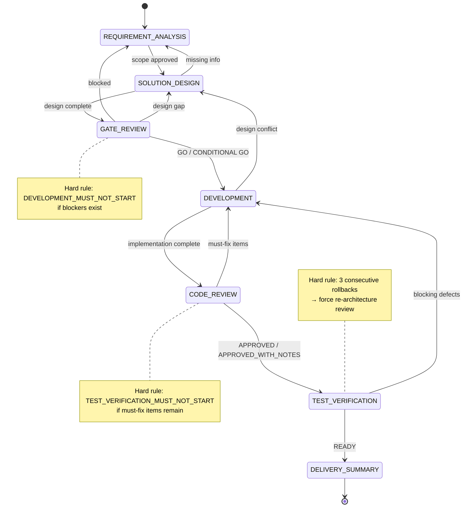
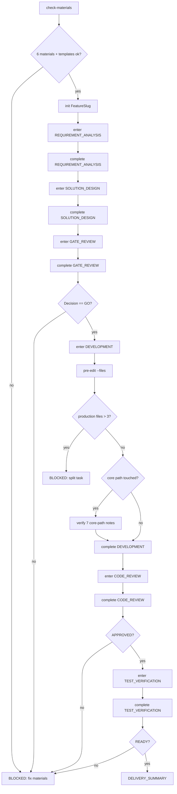

# Agent Team Harness

## Overview

Use this skill to install a reusable `.agent` team workflow into another repository and adapt it to that repository's language, code structure, validation commands, and available model set.

## Initialization Workflow

1. Inspect the target project structure, existing instructions, major languages, test/build files, and high-risk code paths.
2. Discover or request the currently available model names. If the environment cannot list models, ask the user or pass a known list through `--models`.
3. Run the initializer:

```bash
python skills/agent-team-harness/scripts/init_agent_team.py --target /path/to/project --models "model-a,model-b"
```

4. Review generated files before starting development:

- `.agent/harness.yaml`
- `.agent/rule.md`
- `.agent/materials/project-code-profile.md`
- `.agent/generated/model-routing.md`
- `.agent/generated/production_paths.txt`
- `.agent/generated/core_paths.txt`

5. If the target already has `.agent` files, do not overwrite them silently. Use `--force` only when the user approves replacing local project rules.

## Model Routing Rule

Read `references/model-routing.md` when choosing or reviewing role models.

Default policy:

- Implementation and code review roles receive the strongest available coding model and highest practical reasoning effort.
- Architecture and performance roles receive a strong reasoning model, usually one step below implementation unless the change is core-path or high-risk.
- PM, requirement, gate, and QA roles receive a balanced model unless the project owner raises risk level.
- If model availability differs by project, regenerate `.agent/harness.yaml` with the project's model list instead of copying another repository's fixed routing.

## Feature Workflow

After initialization, large requirements must move through:



Use `.agent/scripts/workflow_guard.py` to initialize documents and enforce stage gates. Treat a non-zero guard result as a blocker.

### Guard Commands



## Continuous Improvement

After a large feature finishes, run:

```bash
python .agent/scripts/feature_improvement.py <FeatureSlug>
```

Review the generated note and update `.agent/materials`, `.agent/rule.md`, templates, or role skills only when the feature produced a reusable rule, pattern, checklist item, or failure mode.

## Resources

- `scripts/init_agent_team.py`: deterministic initializer for target projects.
- `assets/project-agent/.agent`: reusable project-local team template.
- `references/model-routing.md`: model selection policy.
- `references/initialization-workflow.md`: detailed review checklist for initialization.
